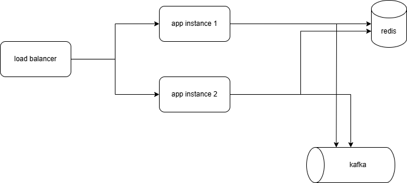

# Running the application
1. Run zookeeper, kafka and redis from docker compose file
2. Run app for example wih ```gradle bootRun```

(I also provided a jar file called "coding-challenge-0.0.1-SNAPSHOT.jar")


# Thought process
Initially I was using a ConcurrentHashMap to ids with which the endpoint was already called, but this will not be shared when
we have multiple instances of our application. Because of that it will now be stored in redis which can be used be multiple instances at once. 
For the third extension data is now also being send to kafka. 

# Architecture



# Shortcuts I took
* Probably a cronjob will be better than using Spring Boot @Scheduled Annotation
* Im running the app locally instead of inside a docker container
* Data could be send to kafka in a better format
* Logic should be split into more classes
* Tests should be written